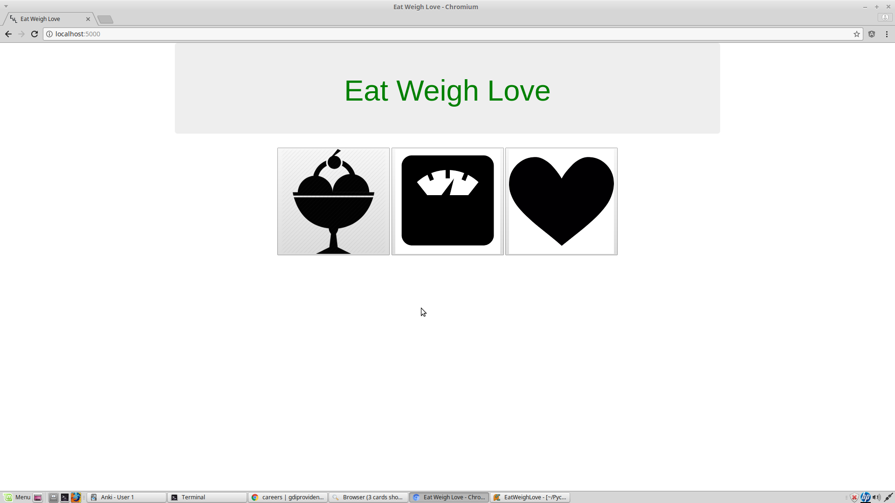
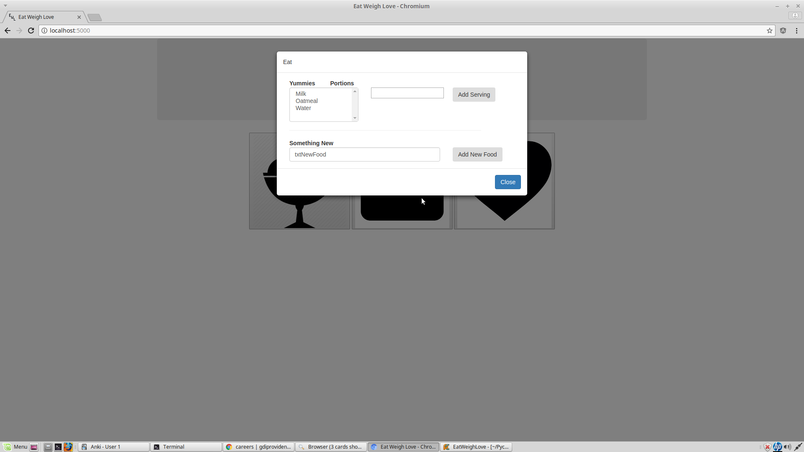
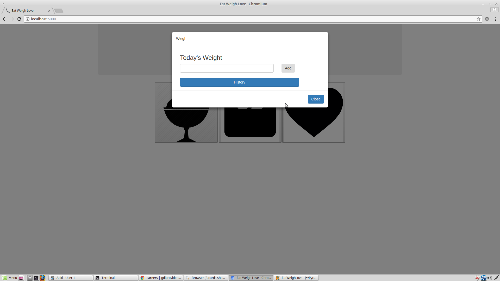
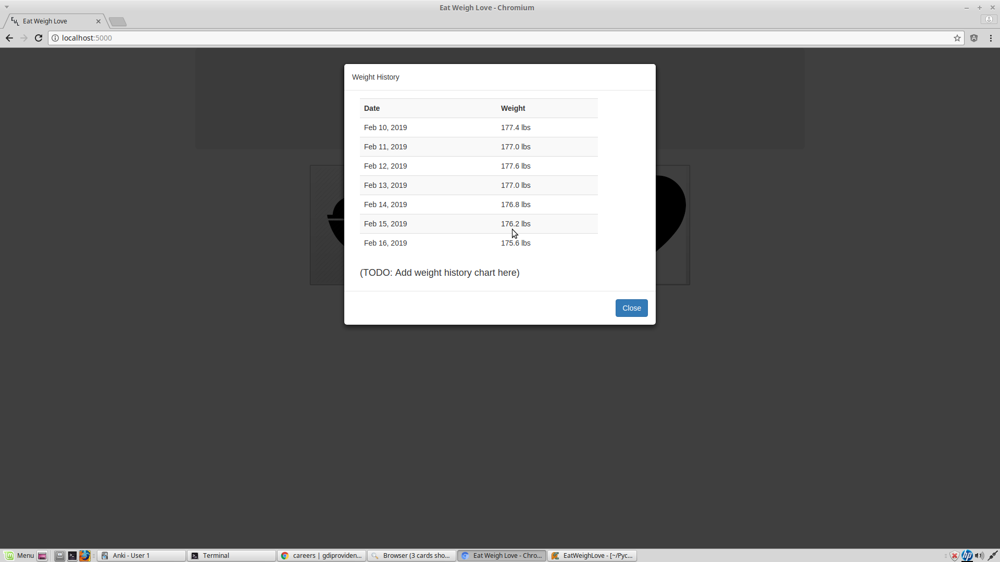
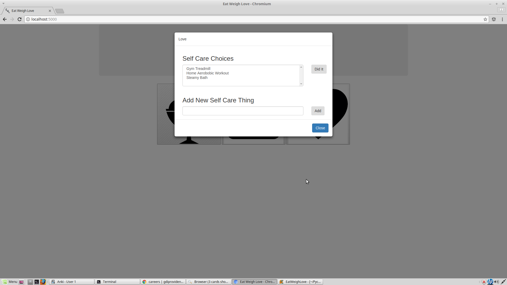

# Eat Weigh Love
An application for promoting weight management, good eating habits, and being good to yourself.

# What it is
Tracking food choices and exercise is important. But an often important part of diet and exercise is being 
good to yourself in general. That's where self-care comes in. Self-care doesn't have to be physically health
related either. Any activity that is good for your morale or overall well being counts.

Eat Weigh Love works with the assumption that food, exercise, and general self care belongs together. Therefore,
tracking those things together is a simple intuitive application is natural and leads to better overall results.

# What It Looks Like

#### Main Screen

#### Food Screen

#### Weight Screen

#### Weight History Screen

#### Self Care Screen

